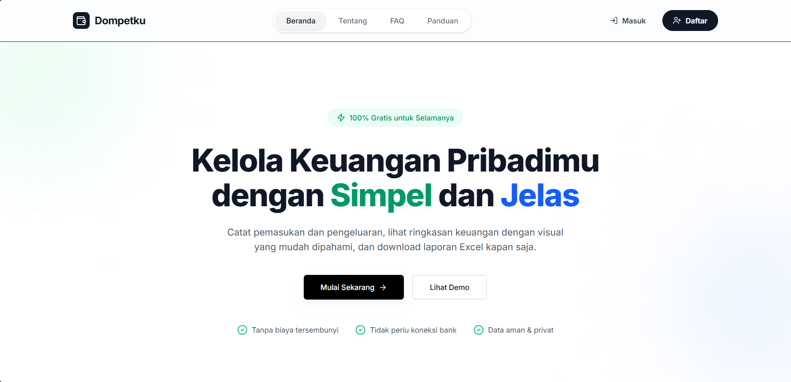

# Dompetku - Personal Finance Manager

**Akses Aplikasi:**
[https://website-dompetku.vercel.app](https://website-dompetku.vercel.app)

**Dompetku** adalah aplikasi manajemen keuangan pribadi berbasis web yang dirancang untuk membantu pengguna melacak pemasukan, pengeluaran, dan target tabungan mereka dengan mudah, modern, dan transparan.

---

## Tujuan & Masalah yang Diselesaikan

### Masalah
Banyak orang kesulitan mengatur keuangan karena:
1.  **Lupa mencatat pengeluaran harian**, sehingga uang "hilang" tanpa jejak.
2.  **Pencatatan manual (kertas/Excel) yang ribet** dan tidak bisa diakses di mana saja.
3.  **Kesulitan memantau target tabungan** (misal: dana darurat atau beli gadget impian) karena tercampur dengan uang harian.
4.  **Kurangnya visualisasi** mengenai kesehatan finansial mereka secara real-time.

### Solusi & Tujuan Dompetku
Dompetku hadir untuk:
* Memberikan platform pencatatan yang **cepat dan intuitif**.
* Memisahkan **dana operasional** dengan **dana tabungan/impian**.
* Menyediakan **laporan visual** (grafik) dan laporan terperinci yang bisa diunduh.
* Membantu pengguna mencapai **kebebasan finansial** melalui pengelolaan yang lebih baik.

---

## Fitur Utama

### 1. Dashboard Interaktif
* Ringkasan total pemasukan, pengeluaran, dan saldo saat ini secara real-time.
* Grafik Arus Keuangan untuk melihat tren cashflow (Harian, Bulanan, Tahunan).
* Daftar transaksi terbaru untuk kilas balik cepat.

### 2. Pencatatan Transaksi
* Input mudah untuk **Pemasukan** dan **Pengeluaran**.
* Kategorisasi otomatis (Makan, Transport, Gaji, Investasi, dll).
* Keterangan tambahan untuk detail transaksi.

### 3. Target Tabungan (Goals)
Fitur unggulan untuk memisahkan tabungan impian:
* **Buat Target:** Set nama (misal: "Beli Laptop") dan nominal target.
* **Progress Bar:** Visualisasi persentase ketercapaian target.
* **Kelola Saldo:** Fitur khusus untuk **Menabung** (tambah saldo target) atau **Tarik Saldo** (ambil dari target) tanpa mengganggu pencatatan harian utama.

### 4. Laporan & Export Data
* Filter laporan berdasarkan rentang waktu.
* **Download Excel (.xlsx):** Fitur ekspor data canggih dengan opsi preset (7 hari, 1 tahun, Semua Data) dan kemampuan **Custom Filename** (penamaan file manual).

### 5. Keamanan & Autentikasi
* Sistem Register & Login yang aman.
* Enkripsi password menggunakan **BCrypt**.
* Proteksi sesi menggunakan **JWT (JSON Web Token)** dan **Cookies**.

---

## Teknologi yang Digunakan

Aplikasi ini dibangun menggunakan arsitektur **Monolith** (atau terpisah Client-Server) dengan teknologi modern:

### Frontend (Client Side)
* **Framework:** [Next.js](https://nextjs.org/) (React) - Untuk performa tinggi dan SEO friendly.
* **Styling:** [Tailwind CSS](https://tailwindcss.com/) - Untuk desain UI yang modern dan responsif.
* **HTTP Client:** Axios - Untuk komunikasi dengan Backend.
* **Icons:** Lucide React.
* **Notifikasi:** React Hot Toast.

### Backend (Server Side)
* **Runtime:** [Node.js](https://nodejs.org/) & [Express.js](https://expressjs.com/).
* **Database ORM:** [Prisma ORM](https://www.prisma.io/).
* **Database:** (MySQL / PostgreSQL - *sesuaikan dengan DB Anda*).
* **Excel Generator:** ExcelJS.
* **Auth:** JSON Web Token (JWT) & BCrypt.js.

---

## Cara Kerja Sistem

Berikut adalah alur kerja teknis dari aplikasi Dompetku:

1.  **Autentikasi (The Gatekeeper):**
    * User melakukan login. Backend memverifikasi hash password.
    * Jika valid, Backend mengirimkan **HTTP-Only Cookie** berisi token JWT ke browser.
    * Middleware di Frontend (Next.js) dan Backend akan selalu mengecek token ini setiap kali user mengakses halaman atau meminta data privasi.

2.  **Alur Transaksi (CRUD):**
    * User menginput data di Frontend -> dikirim via API (`POST /transactions`) -> Backend memvalidasi data -> Prisma menyimpan ke Database.
    * Saat Dashboard dibuka, Frontend me-request data (`GET /summary`) -> Backend melakukan agregasi (SUM income/expense) -> Hasil dikirim balik untuk ditampilkan.

3.  **Logika Target Tabungan:**
    * Tabungan target disimpan di tabel terpisah (`Goals`).
    * Saat user menabung ke target, sistem hanya mengupdate saldo di tabel Goals, memisahkannya dari logika saldo harian agar pengguna fokus pada tujuan.

4.  **Mekanisme Export Excel:**
    * User memilih rentang tanggal di Frontend.
    * Backend melakukan *query* data sesuai filter tanggal.
    * Backend menggunakan `ExcelJS` untuk menggambar tabel, header tebal, dan ringkasan saldo secara virtual.
    * File dikirim sebagai `blob` (binary) ke browser, dan browser memaksanya untuk diunduh sebagai file `.xlsx`.

---

## Author

Dikembangkan oleh **RIZAL MAHARDIKA PUTRA**.